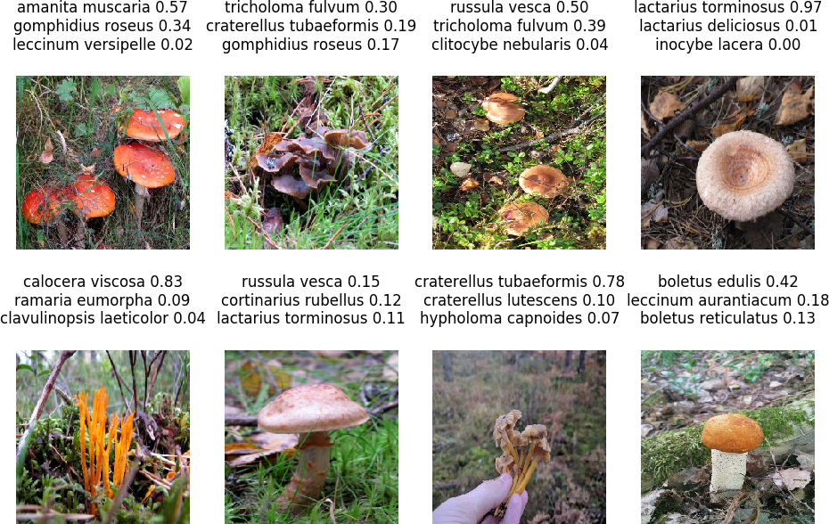

# opi-tuntemaan-sienet

<b>Important</b>: Mushrooms cannot be reliably identified based only on an image, always consult an expert before eating wild mushrooms. This is a toy, do not eat anything "identified" by this program.

## What?

This repository contains code for training a convolutional neural network classifier to correctly guess the species of a mushroom.

## Why?

Because mushrooms are inherently interesting.

## How?

### Classifier

To reduce the size of the dataset required for training, we 
use a transfer learning approach. A pretrained network (ResNet50) trained on [ImageNet](http://www.image-net.org/) data is used as a visual feature extractor and only a new top layer is trained to classify mushrooms. 

### Data

The python webscraping framework [scrapy](https://scrapy.org/) is used to gather an image dataset from several (more or less) reliable sources. 

Images are augmented using [Keras'](https://keras.io/) ImageDataGenerator to futher reduce the number of samples needed.

### Usage

First install required libraries:

``pip install scrapy pillow keras tensorflow pandas``

It will be helpful (but not necessary) to configure tensorflow to use GPU resources if available.

Helper scripts `data/webscraper/run.sh` and `data/wrangle.py`
gather and aggregate the dataset. 
Images are not included in this repository due to copyright issues.
Please scrape responsibly!

The classifier is trained with [transfer.py](./transfer.py) and images are classified with [predict.py](./predict.py)

## Results

With a dataset of 5212 images from 173 species of mushrooms,
the trained classifier correctly guesses the mushroom 30% of
the time, and has a top-5 accuracy of about 60% (based on a test set of 100 images).

Testing the classifier on my own photos gives reasonable results. The distinctive Amanita muscaria (punakärpässieni), Lactarius torminosus (karvarousku), and Calocera viscosa (keltasarvikka) are easily identified. 

## Ideas for further development

- More training data is needed. Even with image augmentations and only one dense layer to train, the model will overfit the current training data. 
- Categorizing training images by type (cap/stem/gills) etc.
- Using object detection to focus on the mushroom and not the background. 
- Making better use of high resolution original images.
- Google image search API to gather more data.
- Long walks in the woods.